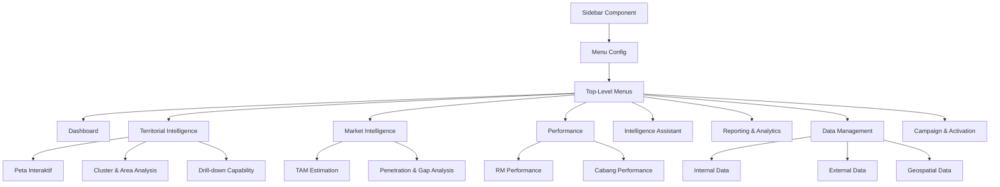

# Design Document: Menu Restructure & Territorial Intelligence

## Overview

This design document specifies the technical architecture for restructuring the BRI Intelligence Dashboard from a 3-menu structure to a comprehensive 8-menu navigation system with multi-level submenus. The redesign transforms the application into a full-featured territorial intelligence platform with geospatial analysis, market intelligence, performance tracking, AI-powered insights, reporting capabilities, data management, and campaign activation features.

### Design Goals

1. **Scalable Navigation Architecture**: Implement a flexible multi-level navigation system that supports expandable/collapsible submenus
2. **Modular Component Structure**: Design reusable components that can be composed into complex page layouts
3. **Efficient Routing**: Create a routing structure that supports deep linking and maintains navigation state
4. **Enhanced AI Integration**: Extend the existing Chatbot component to support visual outputs (charts, tables, maps)
5. **Role-Based Access Control**: Implement filtering logic that adapts views based on user roles
6. **Performance Optimization**: Ensure smooth transitions and lazy loading for optimal user experience
7. **Maintainability**: Establish clear separation of concerns between navigation, routing, state management, and UI components

### Technology Stack

- **Frontend Framework**: React 19 with TypeScript
- **Build Tool**: Vite 6.2
- **Routing**: React Router v6 (to be added)
- **State Management**: React Context API + Redux Toolkit (to be added for complex state)
- **Styling**: Tailwind CSS 4.1
- **Charts**: Recharts 3.7
- **Maps**: Leaflet 1.9 + React Leaflet 5.0
- **Animation**: Motion 12.34
- **AI Integration**: Google Gemini API
- **Icons**: Lucide React


## Architecture

### High-Level Architecture

The application follows a layered architecture pattern:

```
┌─────────────────────────────────────────────────────────────┐
│                     Presentation Layer                       │
│  ┌──────────────┐  ┌──────────────┐  ┌──────────────┐      │
│  │   Sidebar    │  │    Header    │  │  Page Views  │      │
│  │  Navigation  │  │   Controls   │  │  Components  │      │
│  └──────────────┘  └──────────────┘  └──────────────┘      │
└─────────────────────────────────────────────────────────────┘
                            │
┌─────────────────────────────────────────────────────────────┐
│                      Routing Layer                           │
│  ┌──────────────────────────────────────────────────────┐   │
│  │  React Router (Route Definitions & Navigation Logic) │   │
│  └──────────────────────────────────────────────────────┘   │
└─────────────────────────────────────────────────────────────┘
                            │
┌─────────────────────────────────────────────────────────────┐
│                   State Management Layer                     │
│  ┌──────────────┐  ┌──────────────┐  ┌──────────────┐      │
│  │   Context    │  │    Redux     │  │    Local     │      │
│  │   (Auth,     │  │   (Complex   │  │    State     │      │
│  │   Filters)   │  │    State)    │  │  (Component) │      │
│  └──────────────┘  └──────────────┘  └──────────────┘      │
└─────────────────────────────────────────────────────────────┘
                            │
┌─────────────────────────────────────────────────────────────┐
│                      Business Logic Layer                    │
│  ┌──────────────┐  ┌──────────────┐  ┌──────────────┐      │
│  │   Hooks      │  │   Services   │  │   Utilities  │      │
│  │  (Custom)    │  │  (API Calls) │  │   (Helpers)  │      │
│  └──────────────┘  └──────────────┘  └──────────────┘      │
└─────────────────────────────────────────────────────────────┘
                            │
┌─────────────────────────────────────────────────────────────┐
│                        Data Layer                            │
│  ┌──────────────┐  ┌──────────────┐  ┌──────────────┐      │
│  │  Mock Data   │  │   API Client │  │   Local      │      │
│  │  (Dev Mode)  │  │  (Production)│  │   Storage    │      │
│  └──────────────┘  └──────────────┘  └──────────────┘      │
└─────────────────────────────────────────────────────────────┘
```

### Navigation Architecture

The navigation system uses a hierarchical menu structure with dynamic routing:




## Components and Interfaces

### Component Hierarchy

```
App
├── Router
│   ├── Layout
│   │   ├── Sidebar (Enhanced with multi-level navigation)
│   │   ├── Header
│   │   └── Outlet (Page Content)
│   │       ├── DashboardPage
│   │       ├── TerritorialIntelligencePage
│   │       │   ├── InteractiveMapView
│   │       │   ├── ClusterAnalysisView
│   │       │   └── DrillDownView
│   │       ├── MarketIntelligencePage
│   │       │   ├── TAMEstimationView
│   │       │   └── PenetrationAnalysisView
│   │       ├── PerformancePage
│   │       │   ├── RMPerformanceView
│   │       │   └── BranchPerformanceView
│   │       ├── IntelligenceAssistantPage (Enhanced Chatbot)
│   │       ├── ReportingPage
│   │       ├── DataManagementPage
│   │       │   ├── InternalDataView
│   │       │   ├── ExternalDataView
│   │       │   └── GeospatialDataView
│   │       └── CampaignPage
│   └── AuthProvider
│       └── FilterProvider
```

### Core Component Specifications

#### 1. Enhanced Sidebar Component

**File**: `src/components/Sidebar.tsx`

**Purpose**: Multi-level navigation with expandable submenus

**Interface**:
```typescript
interface MenuItem {
  id: string;
  label: string;
  icon: LucideIcon;
  path?: string;
  submenus?: SubMenuItem[];
}

interface SubMenuItem {
  id: string;
  label: string;
  path: string;
}

interface SidebarProps {
  isCollapsed?: boolean;
  onToggleCollapse?: () => void;
}
```

**Key Features**:
- Expandable/collapsible submenu sections
- Active state highlighting for current route
- Maintains expansion state during navigation
- Responsive collapse on mobile
- Keyboard navigation support


#### 2. Enhanced Intelligence Assistant Component

**File**: `src/components/IntelligenceAssistant.tsx` (renamed from Chatbot.tsx)

**Purpose**: AI-powered conversational interface with visual output generation

**Interface**:
```typescript
interface ChatMessage {
  role: 'user' | 'model';
  content: string;
  visualOutput?: VisualOutput;
  timestamp: Date;
}

interface VisualOutput {
  type: 'chart' | 'table' | 'map';
  data: any;
  config?: ChartConfig | TableConfig | MapConfig;
}

interface ChartConfig {
  chartType: 'bar' | 'line' | 'pie' | 'area';
  xAxis?: string;
  yAxis?: string;
  title?: string;
}

interface TableConfig {
  columns: string[];
  sortable?: boolean;
}

interface MapConfig {
  center: [number, number];
  zoom: number;
  markers?: MapMarker[];
  heatmap?: HeatmapData;
}
```

**Key Features**:
- Maintains existing conversational interface
- Automatically detects when visual output is needed
- Renders charts inline using Recharts
- Renders tables with sorting/filtering
- Renders maps using Leaflet
- Supports markdown formatting in text responses

#### 3. Page Layout Components

**Base Page Layout**:
```typescript
interface PageLayoutProps {
  title: string;
  subtitle?: string;
  actions?: React.ReactNode;
  filters?: React.ReactNode;
  children: React.ReactNode;
}
```

**Common Page Sections**:
- PageHeader: Title, subtitle, action buttons
- PageFilters: Filter controls (territory, date range, etc.)
- PageContent: Main content area with responsive grid
- PageFooter: Optional footer with metadata


#### 4. Map Components

**InteractiveMap Component**:
```typescript
interface InteractiveMapProps {
  layers: MapLayer[];
  heatmaps: HeatmapLayer[];
  boundaries: BoundaryLayer[];
  onRegionClick?: (region: Region) => void;
  radiusAnalysis?: RadiusConfig;
  polygonSelection?: boolean;
}

interface MapLayer {
  id: string;
  name: string;
  type: 'branch' | 'atm' | 'merchant' | 'customer' | 'competitor' | 'poi';
  data: GeoPoint[];
  visible: boolean;
  icon?: string;
  color?: string;
}

interface HeatmapLayer {
  id: string;
  name: string;
  type: 'casa' | 'qris' | 'credit' | 'merchant-density';
  data: HeatmapPoint[];
  visible: boolean;
  gradient?: string[];
}

interface BoundaryLayer {
  id: string;
  level: 'province' | 'city' | 'district' | 'village';
  geojson: GeoJSON;
  visible: boolean;
}
```

#### 5. Chart Components

**Reusable Chart Wrappers**:
- `TrendLineChart`: Time series data visualization
- `BarComparisonChart`: Comparative bar charts
- `PieDistributionChart`: Category distribution
- `HeatmapChart`: Matrix heatmap visualization
- `FunnelChart`: Conversion funnel visualization
- `GaugeChart`: KPI gauge indicators

All chart components follow this pattern:
```typescript
interface ChartProps {
  data: any[];
  config: ChartConfig;
  height?: number;
  loading?: boolean;
  error?: string;
}
```

#### 6. Data Table Components

**DataTable Component**:
```typescript
interface DataTableProps<T> {
  data: T[];
  columns: ColumnDef<T>[];
  sortable?: boolean;
  filterable?: boolean;
  exportable?: boolean;
  pagination?: PaginationConfig;
  onRowClick?: (row: T) => void;
}

interface ColumnDef<T> {
  key: keyof T;
  header: string;
  sortable?: boolean;
  filterable?: boolean;
  render?: (value: any, row: T) => React.ReactNode;
  width?: string;
}
```


### Routing Structure

**Route Configuration**:

```typescript
// src/routes/index.tsx
const routes = [
  {
    path: '/',
    element: <Layout />,
    children: [
      {
        index: true,
        element: <Navigate to="/dashboard" replace />
      },
      {
        path: 'dashboard',
        element: <DashboardPage />
      },
      {
        path: 'territorial-intelligence',
        children: [
          {
            index: true,
            element: <Navigate to="interactive-map" replace />
          },
          {
            path: 'interactive-map',
            element: <InteractiveMapView />
          },
          {
            path: 'cluster-analysis',
            element: <ClusterAnalysisView />
          },
          {
            path: 'drill-down',
            element: <DrillDownView />
          }
        ]
      },
      {
        path: 'market-intelligence',
        children: [
          {
            index: true,
            element: <Navigate to="tam-estimation" replace />
          },
          {
            path: 'tam-estimation',
            element: <TAMEstimationView />
          },
          {
            path: 'penetration-analysis',
            element: <PenetrationAnalysisView />
          }
        ]
      },
      {
        path: 'performance',
        children: [
          {
            index: true,
            element: <Navigate to="rm-performance" replace />
          },
          {
            path: 'rm-performance',
            element: <RMPerformanceView />
          },
          {
            path: 'branch-performance',
            element: <BranchPerformanceView />
          }
        ]
      },
      {
        path: 'intelligence-assistant',
        element: <IntelligenceAssistantPage />
      },
      {
        path: 'reporting',
        element: <ReportingPage />
      },
      {
        path: 'data-management',
        children: [
          {
            index: true,
            element: <Navigate to="internal-data" replace />
          },
          {
            path: 'internal-data',
            element: <InternalDataView />
          },
          {
            path: 'external-data',
            element: <ExternalDataView />
          },
          {
            path: 'geospatial-data',
            element: <GeospatialDataView />
          }
        ]
      },
      {
        path: 'campaign',
        element: <CampaignPage />
      }
    ]
  }
];
```

**Route Guards**:
- Role-based access control middleware
- Authentication check before rendering protected routes
- Automatic redirection for unauthorized access


## Data Models

### Core Domain Models

#### User and Authentication

```typescript
interface User {
  id: string;
  name: string;
  email: string;
  phone: string;
  role: UserRole;
  assignedArea?: AssignedArea;
  avatar?: string;
}

type UserRole = 'Direksi' | 'Regional Head' | 'Branch Manager' | 'RM';

interface AssignedArea {
  type: 'national' | 'regional' | 'branch' | 'portfolio';
  regionId?: string;
  branchId?: string;
  portfolioId?: string;
}
```

#### Geographical Models

```typescript
interface Region {
  id: string;
  name: string;
  level: 'province' | 'city' | 'district' | 'village';
  parentId?: string;
  boundary: GeoJSON;
  center: [number, number];
  metrics: RegionMetrics;
}

interface RegionMetrics {
  totalCustomers: number;
  totalMerchants: number;
  transactionVolume: number;
  assignedRMs: number;
  targetRealization: number;
  opportunityScore: number;
  casaTotal: number;
  qrisPenetration: number;
}

interface GeoPoint {
  id: string;
  name: string;
  lat: number;
  lng: number;
  type: string;
  metadata?: Record<string, any>;
}
```

#### Performance Models

```typescript
interface RMPerformance {
  id: string;
  name: string;
  email: string;
  phone: string;
  territory: string;
  branch: string;
  portfolio: Portfolio;
  targets: Targets;
  achievements: Achievements;
  status: 'Top Performer' | 'On Track' | 'Needs Improvement';
}

interface Portfolio {
  totalCustomers: number;
  totalMerchants: number;
  casaValue: number; // in billions
  creditOutstanding: number;
}

interface Targets {
  leads: number;
  acquisition: number;
  casa: number;
  qrisActivation: number;
}

interface Achievements {
  acquired: number;
  conversionRate: number;
  casaGrowth: number;
  qrisActivationRate: number;
  merchantReactivationRate: number;
}

interface BranchPerformance {
  id: string;
  name: string;
  code: string;
  location: GeoPoint;
  coverage: BranchCoverage;
  kpis: BranchKPIs;
  rmCount: number;
  territory: string;
}

interface BranchCoverage {
  area: number; // in km²
  districts: string[];
  villages: string[];
  radiusKm: number;
}

interface BranchKPIs {
  totalCustomers: number;
  totalMerchants: number;
  casaTotal: number;
  creditOutstanding: number;
  productivity: number;
  unaddressedOpportunities: number;
}
```


#### Market Intelligence Models

```typescript
interface TAMEstimation {
  regionId: string;
  regionName: string;
  productivePopulation: number;
  potentialMerchants: number;
  purchasingPower: number; // in billions
  marketSize: number; // in billions
  currentPenetration: number; // percentage
  estimatedGap: number; // in billions
}

interface PenetrationAnalysis {
  regionId: string;
  regionName: string;
  productCategories: ProductPenetration[];
  overallPenetration: number;
  gapVsPotential: number;
  priorityScore: number;
}

interface ProductPenetration {
  product: 'CASA' | 'Credit' | 'QRIS' | 'Savings';
  penetrationRate: number;
  potential: number;
  gap: number;
}
```

#### Campaign Models

```typescript
interface Campaign {
  id: string;
  name: string;
  type: 'acquisition' | 'reactivation' | 'retention';
  status: 'draft' | 'active' | 'completed';
  targetRegions: string[];
  targetMerchants: string[];
  assignedRMs: string[];
  startDate: Date;
  endDate: Date;
  metrics: CampaignMetrics;
}

interface CampaignMetrics {
  targetCount: number;
  contacted: number;
  converted: number;
  conversionRate: number;
  revenue: number;
}

interface DormantMerchant {
  id: string;
  name: string;
  location: GeoPoint;
  lastActivityDate: Date;
  daysSinceActivity: number;
  historicalValue: number;
  assignedRM?: string;
  priority: 'high' | 'medium' | 'low';
}
```

#### Data Management Models

```typescript
interface DataSource {
  id: string;
  name: string;
  type: 'internal' | 'external' | 'geospatial';
  category: string;
  lastUpdated: Date;
  recordCount: number;
  qualityMetrics: DataQualityMetrics;
}

interface DataQualityMetrics {
  completeness: number; // percentage
  accuracy: number; // percentage
  consistency: number; // percentage
  timeliness: number; // days since update
}

interface InternalData {
  customers: Customer[];
  merchants: Merchant[];
  transactions: Transaction[];
  rms: RMPerformance[];
  branches: BranchPerformance[];
}

interface ExternalData {
  demographics: DemographicData[];
  regionalGDP: GDPData[];
  pois: POI[];
  merchantDirectory: MerchantDirectory[];
}

interface GeospatialData {
  boundaries: BoundaryData[];
  coordinates: CoordinateData[];
  mapLayers: MapLayerConfig[];
}
```


### State Management Architecture

The application uses a hybrid state management approach:

#### 1. React Context for Global State

**AuthContext**: User authentication and role information
```typescript
interface AuthContextValue {
  user: User | null;
  isAuthenticated: boolean;
  login: (credentials: Credentials) => Promise<void>;
  logout: () => void;
  hasPermission: (permission: string) => boolean;
}
```

**FilterContext**: Global filter state shared across pages
```typescript
interface FilterContextValue {
  filters: GlobalFilters;
  updateFilters: (filters: Partial<GlobalFilters>) => void;
  resetFilters: () => void;
}

interface GlobalFilters {
  dateRange: DateRange;
  territory: string[];
  branch: string[];
  product: string[];
  rmId?: string;
}
```

#### 2. Redux Toolkit for Complex State

**Store Structure**:
```typescript
interface RootState {
  navigation: NavigationState;
  territorial: TerritorialState;
  market: MarketState;
  performance: PerformanceState;
  campaign: CampaignState;
  data: DataState;
}

interface NavigationState {
  expandedMenus: string[];
  activeRoute: string;
  breadcrumbs: Breadcrumb[];
}

interface TerritorialState {
  selectedRegion: Region | null;
  mapLayers: MapLayer[];
  heatmaps: HeatmapLayer[];
  boundaries: BoundaryLayer[];
  drillDownHistory: Region[];
}
```

**Redux Slices**:
- `navigationSlice`: Menu expansion state, active routes
- `territorialSlice`: Map state, selected regions, layers
- `marketSlice`: TAM data, penetration analysis, competitive data
- `performanceSlice`: RM and branch performance data
- `campaignSlice`: Campaign data and metrics
- `dataSlice`: Data management state

#### 3. React Query for Server State

Use React Query (TanStack Query) for data fetching and caching:

```typescript
// Example: Fetching RM performance data
const useRMPerformance = (filters: FilterParams) => {
  return useQuery({
    queryKey: ['rm-performance', filters],
    queryFn: () => fetchRMPerformance(filters),
    staleTime: 5 * 60 * 1000, // 5 minutes
    cacheTime: 10 * 60 * 1000, // 10 minutes
  });
};
```

**Benefits**:
- Automatic caching and background refetching
- Loading and error states handled automatically
- Optimistic updates for mutations
- Request deduplication


### Menu Configuration

**Menu Structure Definition**:

```typescript
// src/config/menuConfig.ts
export const MENU_CONFIG: MenuItem[] = [
  {
    id: 'dashboard',
    label: 'Dashboard',
    icon: LayoutDashboard,
    path: '/dashboard',
  },
  {
    id: 'territorial-intelligence',
    label: 'Territorial Intelligence',
    icon: Map,
    submenus: [
      {
        id: 'interactive-map',
        label: 'Peta Interaktif',
        path: '/territorial-intelligence/interactive-map',
      },
      {
        id: 'cluster-analysis',
        label: 'Cluster & Area Analysis',
        path: '/territorial-intelligence/cluster-analysis',
      },
      {
        id: 'drill-down',
        label: 'Drill-down Capability',
        path: '/territorial-intelligence/drill-down',
      },
    ],
  },
  {
    id: 'market-intelligence',
    label: 'Market Intelligence',
    icon: TrendingUp,
    submenus: [
      {
        id: 'tam-estimation',
        label: 'TAM Estimation',
        path: '/market-intelligence/tam-estimation',
      },
      {
        id: 'penetration-analysis',
        label: 'Penetration & Gap Analysis',
        path: '/market-intelligence/penetration-analysis',
      },
    ],
  },
  {
    id: 'performance',
    label: 'Performance',
    icon: Users,
    submenus: [
      {
        id: 'rm-performance',
        label: 'RM Performance',
        path: '/performance/rm-performance',
      },
      {
        id: 'branch-performance',
        label: 'Cabang Performance',
        path: '/performance/branch-performance',
      },
    ],
  },
  {
    id: 'intelligence-assistant',
    label: 'Intelligence Assistant',
    icon: Sparkles,
    path: '/intelligence-assistant',
  },
  {
    id: 'reporting',
    label: 'Reporting & Analytics',
    icon: BarChart3,
    path: '/reporting',
  },
  {
    id: 'data-management',
    label: 'Data Management',
    icon: Database,
    submenus: [
      {
        id: 'internal-data',
        label: 'Internal Data',
        path: '/data-management/internal-data',
      },
      {
        id: 'external-data',
        label: 'External Data',
        path: '/data-management/external-data',
      },
      {
        id: 'geospatial-data',
        label: 'Geospatial Data',
        path: '/data-management/geospatial-data',
      },
    ],
  },
  {
    id: 'campaign',
    label: 'Campaign & Activation',
    icon: Target,
    path: '/campaign',
  },
];
```


### UI/UX Design Patterns

#### Navigation Patterns

**Submenu Expansion Behavior**:
1. Click parent menu → Toggle submenu expansion
2. Click submenu item → Navigate to route and keep parent expanded
3. Navigate to different parent → Collapse previous parent, expand new parent
4. Direct URL access → Auto-expand parent menu containing active route

**Active State Indicators**:
- Parent menu: Highlighted background when any child is active
- Submenu item: Bold text + indicator icon when active
- Breadcrumb trail in header showing current location

**Responsive Behavior**:
- Desktop (≥768px): Full sidebar with labels
- Mobile (<768px): Collapsible hamburger menu
- Tablet: Optional collapsed sidebar with icons only

#### Visual Hierarchy

**Color System**:
```typescript
const colorScheme = {
  primary: 'indigo-600',      // Primary actions, active states
  secondary: 'slate-600',     // Secondary text, inactive states
  success: 'emerald-600',     // Positive metrics, success states
  warning: 'amber-600',       // Warnings, attention needed
  danger: 'red-600',          // Errors, critical alerts
  info: 'blue-600',           // Informational content
  neutral: 'slate-50',        // Backgrounds, borders
};
```

**Typography Scale**:
- Page Title: `text-3xl font-bold`
- Section Title: `text-xl font-bold`
- Card Title: `text-lg font-semibold`
- Body Text: `text-sm font-medium`
- Caption: `text-xs font-medium`

**Spacing System**:
- Page padding: `p-8`
- Section gap: `space-y-8`
- Card padding: `p-6`
- Component gap: `gap-4`

#### Animation Patterns

**Page Transitions**:
```typescript
const pageTransition = {
  initial: { opacity: 0, y: 20 },
  animate: { opacity: 1, y: 0 },
  exit: { opacity: 0, y: -20 },
  transition: { duration: 0.3 }
};
```

**Submenu Expansion**:
```typescript
const submenuAnimation = {
  initial: { height: 0, opacity: 0 },
  animate: { height: 'auto', opacity: 1 },
  exit: { height: 0, opacity: 0 },
  transition: { duration: 0.2 }
};
```

**Loading States**:
- Skeleton loaders for data tables
- Spinner for async operations
- Progress bars for file uploads
- Shimmer effect for images


#### Intelligence Assistant Visual Output Design

**Chart Rendering Strategy**:

The Intelligence Assistant will detect query intent and automatically generate appropriate visualizations:

```typescript
interface QueryAnalysis {
  intent: 'comparison' | 'trend' | 'distribution' | 'geographical' | 'tabular';
  entities: string[];
  timeframe?: DateRange;
  metrics: string[];
}

const determineVisualization = (analysis: QueryAnalysis): VisualOutput => {
  if (analysis.intent === 'geographical') {
    return { type: 'map', config: { /* map config */ } };
  }
  if (analysis.intent === 'trend') {
    return { type: 'chart', config: { chartType: 'line' } };
  }
  if (analysis.intent === 'comparison') {
    return { type: 'chart', config: { chartType: 'bar' } };
  }
  if (analysis.intent === 'distribution') {
    return { type: 'chart', config: { chartType: 'pie' } };
  }
  return { type: 'table', config: { /* table config */ } };
};
```

**Example Query Mappings**:
- "Show RM performance by territory" → Bar chart
- "CASA growth over last 6 months" → Line chart
- "Merchant distribution by category" → Pie chart
- "Top 10 regions by opportunity gap" → Table
- "Show merchant density in Menteng" → Map with heatmap

**Visual Output Components**:
```typescript
// src/components/IntelligenceAssistant/VisualOutputRenderer.tsx
const VisualOutputRenderer: FC<{ output: VisualOutput }> = ({ output }) => {
  switch (output.type) {
    case 'chart':
      return <ChartRenderer data={output.data} config={output.config} />;
    case 'table':
      return <TableRenderer data={output.data} config={output.config} />;
    case 'map':
      return <MapRenderer data={output.data} config={output.config} />;
    default:
      return null;
  }
};
```


### Integration Points

#### 1. Existing Component Integration

**Reusable Existing Components**:
- `StatCard`: Dashboard KPI cards
- `TrendChart`: Time series visualizations
- `GeoMap` / `LeafletMap` / `SimpleLeafletMap`: Map visualizations
- `RMPerformanceCard`: RM detail cards
- `RMLeaderboard`: Performance rankings
- `FilterPanel`: Global filter controls
- `DistrictChart`: District performance bars
- `CategoryPieChart`: Category distributions
- `AcquisitionFunnel`: Funnel visualizations
- `CompetitiveAnalysis`: Competitive comparison charts

**Integration Strategy**:
- Keep existing components unchanged where possible
- Wrap existing components in new page layouts
- Extend components with new props for additional features
- Create new variants for specialized use cases

#### 2. API Integration Points

**Data Fetching Architecture**:

```typescript
// src/services/api/client.ts
class APIClient {
  private baseURL: string;
  
  async get<T>(endpoint: string, params?: any): Promise<T> {
    // Implementation with error handling, retries, etc.
  }
  
  async post<T>(endpoint: string, data: any): Promise<T> {
    // Implementation
  }
  
  // ... other methods
}

// src/services/api/endpoints.ts
export const API_ENDPOINTS = {
  // Dashboard
  dashboard: {
    kpis: '/api/dashboard/kpis',
    alerts: '/api/dashboard/alerts',
  },
  
  // Territorial Intelligence
  territorial: {
    regions: '/api/territorial/regions',
    mapLayers: '/api/territorial/layers',
    heatmaps: '/api/territorial/heatmaps',
    boundaries: '/api/territorial/boundaries',
  },
  
  // Market Intelligence
  market: {
    tam: '/api/market/tam-estimation',
    penetration: '/api/market/penetration-analysis',
  },
  
  // Performance
  performance: {
    rms: '/api/performance/rms',
    branches: '/api/performance/branches',
    leaderboard: '/api/performance/leaderboard',
  },
  
  // Intelligence Assistant
  ai: {
    chat: '/api/ai/chat',
    generateVisual: '/api/ai/generate-visual',
  },
  
  // Data Management
  data: {
    internal: '/api/data/internal',
    external: '/api/data/external',
    geospatial: '/api/data/geospatial',
    upload: '/api/data/upload',
  },
  
  // Campaign
  campaign: {
    list: '/api/campaign/list',
    create: '/api/campaign/create',
    dormantMerchants: '/api/campaign/dormant-merchants',
  },
};
```


#### 3. Google Gemini AI Integration

**Enhanced AI Service**:

```typescript
// src/services/ai/geminiService.ts
class GeminiService {
  private client: GoogleGenAI;
  
  async generateResponse(
    messages: ChatMessage[],
    context: AIContext
  ): Promise<AIResponse> {
    const systemInstruction = this.buildSystemInstruction(context);
    
    const response = await this.client.models.generateContent({
      model: 'gemini-3-flash-preview',
      contents: messages.map(m => ({
        role: m.role,
        parts: [{ text: m.content }]
      })),
      config: { systemInstruction }
    });
    
    return this.parseResponse(response);
  }
  
  private parseResponse(response: any): AIResponse {
    const text = response.text;
    const visualOutput = this.detectVisualOutput(text);
    
    return {
      text: this.cleanText(text),
      visualOutput,
      timestamp: new Date()
    };
  }
  
  private detectVisualOutput(text: string): VisualOutput | undefined {
    // Parse AI response for structured data markers
    // Example: [CHART:bar] or [TABLE] or [MAP]
    // Extract data and configuration
    // Return appropriate VisualOutput object
  }
  
  private buildSystemInstruction(context: AIContext): string {
    return `
      You are BRI Intelligence Assistant, specialized in banking territorial intelligence.
      
      User Context:
      - Role: ${context.user.role}
      - Territory: ${context.user.assignedArea}
      
      Current Filters:
      - Date Range: ${context.filters.dateRange}
      - Territory: ${context.filters.territory}
      
      Capabilities:
      1. Answer questions about territorial performance
      2. Provide market intelligence insights
      3. Analyze RM and branch performance
      4. Generate visual outputs (charts, tables, maps)
      
      When generating visual outputs:
      - Use [CHART:type] markers for charts (bar, line, pie)
      - Use [TABLE] markers for tabular data
      - Use [MAP] markers for geographical visualizations
      - Include structured data in JSON format after markers
      
      Example:
      "Here's the RM performance comparison:
      [CHART:bar]
      {"data": [...], "xAxis": "name", "yAxis": "conversion"}
      "
    `;
  }
}
```

#### 4. Role-Based Access Control

**Permission System**:

```typescript
// src/services/auth/permissions.ts
const PERMISSIONS = {
  'Direksi': {
    viewLevel: 'national',
    canExport: true,
    canManageData: true,
    canCreateCampaigns: true,
    modules: ['*'], // All modules
  },
  'Regional Head': {
    viewLevel: 'regional',
    canExport: true,
    canManageData: false,
    canCreateCampaigns: true,
    modules: [
      'dashboard',
      'territorial-intelligence',
      'market-intelligence',
      'performance',
      'intelligence-assistant',
      'reporting',
      'campaign'
    ],
  },
  'Branch Manager': {
    viewLevel: 'branch',
    canExport: true,
    canManageData: false,
    canCreateCampaigns: false,
    modules: [
      'dashboard',
      'territorial-intelligence',
      'performance',
      'intelligence-assistant',
      'reporting'
    ],
  },
  'RM': {
    viewLevel: 'portfolio',
    canExport: false,
    canManageData: false,
    canCreateCampaigns: false,
    modules: [
      'dashboard',
      'performance',
      'intelligence-assistant'
    ],
  },
};

// Filter data based on user role
const filterDataByRole = (data: any[], user: User): any[] => {
  const permissions = PERMISSIONS[user.role];
  
  switch (permissions.viewLevel) {
    case 'national':
      return data;
    case 'regional':
      return data.filter(item => 
        item.regionId === user.assignedArea?.regionId
      );
    case 'branch':
      return data.filter(item => 
        item.branchId === user.assignedArea?.branchId
      );
    case 'portfolio':
      return data.filter(item => 
        item.rmId === user.id
      );
    default:
      return [];
  }
};
```


## Correctness Properties

*A property is a characteristic or behavior that should hold true across all valid executions of a system—essentially, a formal statement about what the system should do. Properties serve as the bridge between human-readable specifications and machine-verifiable correctness guarantees.*

### Property Reflection

After analyzing all acceptance criteria, I identified the following redundancies and consolidations:

**Redundancy Analysis**:
1. Properties 17.1-17.4 (role-based filtering) can be consolidated into a single property about role-based data filtering
2. Properties 18.1-18.2 (responsive breakpoints) can be consolidated into a single property about responsive behavior
3. Properties 11.4-11.6 (visual output generation) can be consolidated into a single property about visualization type selection
4. Properties 12.5-12.6 (export formats) can be consolidated into a single property about export functionality
5. Navigation performance properties (19.1-19.2) are distinct and should remain separate
6. Keyboard navigation properties (20.1-20.4) are related but test different aspects, should remain separate

**Consolidated Properties**:
- Role-based filtering: One property covering all roles and modules
- Responsive navigation: One property covering all breakpoints
- Visual output generation: One property covering all visualization types
- Export functionality: One property covering all export formats


### Property 1: Submenu Expansion Toggle

*For any* menu item with submenus, clicking the menu item should toggle the expansion state of its submenu list (collapsed to expanded or expanded to collapsed).

**Validates: Requirements 1.4**

### Property 2: Navigation Without Submenus

*For any* menu item without submenus, clicking the menu item should navigate to its corresponding route.

**Validates: Requirements 1.3**

### Property 3: Active Menu Highlighting

*For any* route in the application, the navigation system should highlight the menu item corresponding to that route as active.

**Validates: Requirements 1.5**

### Property 4: Menu State Persistence During Sibling Navigation

*For any* parent menu with submenus, navigating between different submenu items under the same parent should maintain the parent menu's expanded state.

**Validates: Requirements 1.6**

### Property 5: Time Filter Updates All Metrics

*For any* time period filter selection on the dashboard, all displayed metrics should update to reflect data for that time period.

**Validates: Requirements 2.7**

### Property 6: Map Layer Toggle Performance

*For any* map layer, toggling the layer visibility should complete the show/hide operation within 500ms.

**Validates: Requirements 3.7**

### Property 7: Region Click Shows Detail Panel

*For any* region on the map, clicking the region should display a detail panel containing total customers, total merchants, transaction volume, assigned RMs, target versus realization, and opportunity score for that region.

**Validates: Requirements 5.1**

### Property 8: Hierarchical Drill-Down Navigation

*For any* administrative region, the system should support drill-down navigation from province level to city level to district level to village level.

**Validates: Requirements 5.2**

### Property 9: Map View Updates on Drill-Down

*For any* drill-down action to a lower administrative level, the map view should update to focus on the selected region.

**Validates: Requirements 5.3**

### Property 10: RM Leaderboard Sorting

*For any* set of RM performance data, the leaderboard should display RMs sorted in descending order by performance score.

**Validates: Requirements 9.7**

### Property 11: Natural Language Query Processing

*For any* natural language query sent to the Intelligence Assistant, the system should maintain the ability to process the query and generate a relevant response.

**Validates: Requirements 11.2**

### Property 12: Automatic Visualization Type Selection

*For any* user query that requires visual output, the Intelligence Assistant should automatically determine and generate the appropriate visualization type (chart, table, or map) based on query context.

**Validates: Requirements 11.4, 11.5, 11.6, 11.9**

### Property 13: Markdown Rendering in Chat

*For any* AI response containing markdown formatting, the Intelligence Assistant should correctly render the markdown in the chat interface.

**Validates: Requirements 11.7**

### Property 14: Visual Output Inline Display

*For any* visual output generated by the Intelligence Assistant, the output should be displayed inline within the chat conversation.

**Validates: Requirements 11.10**

### Property 15: Export Format Support

*For any* analysis result in the Reporting Module, the system should support exporting the result to both Excel and PDF formats.

**Validates: Requirements 12.5, 12.6**

### Property 16: Data Filtering by Multiple Criteria

*For any* data management view, applying multiple filter criteria should return only records that match all applied criteria.

**Validates: Requirements 13.4**

### Property 17: File Import Functionality

*For any* valid external data file, the Data Management Module should successfully import the file and make the data available in the system.

**Validates: Requirements 14.3**

### Property 18: GeoJSON Upload Validation

*For any* file uploaded as a boundary polygon, the system should validate that the file is in valid GeoJSON format before accepting it.

**Validates: Requirements 15.2**

### Property 19: Coordinate Accuracy Validation

*For any* coordinate data submitted to the system, the system should validate that the coordinate accuracy is within 100 meter tolerance.

**Validates: Requirements 15.3**

### Property 20: Priority Region Ranking

*For any* set of regions with opportunity scores, the Campaign Module should display the regions ranked in descending order by opportunity score.

**Validates: Requirements 16.1**

### Property 21: Region-Based Merchant List Generation

*For any* region selected in the Campaign Module, the system should generate a downloadable list containing all merchants in that region.

**Validates: Requirements 16.5**

### Property 22: Role-Based Data Filtering

*For any* user role (Direksi, Regional Head, Branch Manager, RM) and any module, the system should filter displayed data to match the user's assigned area scope (national, regional, branch, or portfolio respectively).

**Validates: Requirements 17.1, 17.2, 17.3, 17.4**

### Property 23: Responsive Navigation Behavior

*For any* viewport width, the navigation system should display a collapsible hamburger menu when width is less than 768 pixels, and display the full sidebar navigation when width is 768 pixels or greater.

**Validates: Requirements 18.1, 18.2**

### Property 24: Menu State Persistence Across Viewport Changes

*For any* menu expansion state, resizing the viewport should maintain the current expansion state of all menus.

**Validates: Requirements 18.3**

### Property 25: Route Transition Performance

*For any* menu item click, the navigation system should complete the route transition within 300ms.

**Validates: Requirements 19.1**

### Property 26: Submenu Animation Performance

*For any* submenu expansion or collapse action, the animation should complete within 200ms.

**Validates: Requirements 19.2**

### Property 27: Route Component Preloading

*For any* expanded menu section, the navigation system should preload the route components for all submenu items in that section.

**Validates: Requirements 19.3**

### Property 28: Keyboard Navigation Support

*For any* menu item, users should be able to navigate to and activate the menu item using Tab, Enter, and Arrow keys.

**Validates: Requirements 20.1**

### Property 29: ARIA Label Presence

*For any* menu item in the navigation system, the menu item should have an ARIA label attribute.

**Validates: Requirements 20.2**

### Property 30: Focus Indicator Visibility

*For any* menu item that receives keyboard focus, a visible focus indicator should be displayed on that menu item.

**Validates: Requirements 20.3**

### Property 31: Keyboard Activation Equivalence

*For any* menu item, pressing Enter while the item is focused should activate the menu item with the same behavior as clicking it with a mouse.

**Validates: Requirements 20.4**


## Error Handling

### Navigation Errors

**Route Not Found**:
- Display 404 page with navigation back to dashboard
- Log error for monitoring
- Suggest similar valid routes

**Permission Denied**:
- Redirect to appropriate landing page based on role
- Display informative message about access restrictions
- Log unauthorized access attempts

**Navigation State Corruption**:
- Reset navigation state to default
- Redirect to dashboard
- Preserve user session

### Data Loading Errors

**API Request Failures**:
```typescript
interface ErrorResponse {
  code: string;
  message: string;
  details?: any;
  retryable: boolean;
}

const handleAPIError = (error: ErrorResponse) => {
  if (error.retryable) {
    // Show retry button
    // Implement exponential backoff
  } else {
    // Show error message
    // Provide alternative actions
  }
};
```

**Timeout Handling**:
- Set reasonable timeouts (30s for data, 60s for AI)
- Show loading indicators with progress
- Allow user to cancel long-running requests
- Provide retry mechanism

**Partial Data Failures**:
- Display available data
- Show warning for missing sections
- Allow user to refresh specific sections
- Degrade gracefully

### Map and Visualization Errors

**Map Loading Failures**:
- Display fallback static map or placeholder
- Show error message with retry option
- Log tile loading errors
- Provide alternative data views (table, list)

**Chart Rendering Errors**:
- Display error boundary with fallback UI
- Show raw data in table format as fallback
- Log rendering errors for debugging
- Provide export option for raw data

**Invalid GeoJSON**:
- Validate GeoJSON before rendering
- Show specific validation errors
- Provide format examples
- Allow user to correct and resubmit

### AI Integration Errors

**Gemini API Failures**:
```typescript
const handleAIError = (error: any) => {
  if (error.code === 'RATE_LIMIT_EXCEEDED') {
    return 'Too many requests. Please wait a moment and try again.';
  }
  if (error.code === 'INVALID_API_KEY') {
    return 'AI service configuration error. Please contact support.';
  }
  if (error.code === 'TIMEOUT') {
    return 'Request timed out. Please try a simpler query.';
  }
  return 'Unable to process your request. Please try again.';
};
```

**Visual Output Generation Failures**:
- Fall back to text-only response
- Log generation errors
- Provide manual visualization options
- Show partial results if available

### Data Management Errors

**File Upload Failures**:
- Validate file size (max 50MB)
- Validate file format before upload
- Show progress indicator
- Provide clear error messages for validation failures
- Allow retry with corrected file

**Data Import Errors**:
- Validate data schema before import
- Show validation errors with row/column references
- Provide sample data format
- Allow partial import of valid records
- Generate error report for failed records

**Data Quality Issues**:
- Display quality metrics with warnings
- Highlight problematic records
- Provide data cleaning suggestions
- Allow manual correction

### Performance Degradation

**Slow Network**:
- Show loading indicators
- Enable offline mode for cached data
- Reduce data payload size
- Implement pagination

**Large Dataset Handling**:
- Implement virtual scrolling for tables
- Lazy load map markers
- Paginate results
- Provide filtering to reduce dataset

**Memory Issues**:
- Implement cleanup on component unmount
- Limit concurrent map layers
- Clear unused cache
- Monitor memory usage


## Testing Strategy

### Dual Testing Approach

This project will employ both unit testing and property-based testing to ensure comprehensive coverage:

**Unit Tests**: Focus on specific examples, edge cases, error conditions, and integration points
**Property Tests**: Verify universal properties across all inputs through randomization

Both approaches are complementary and necessary for comprehensive coverage. Unit tests catch concrete bugs in specific scenarios, while property tests verify general correctness across a wide range of inputs.

### Unit Testing

**Testing Framework**: Vitest + React Testing Library

**Unit Test Focus Areas**:

1. **Component Rendering**:
   - Verify specific UI elements are rendered correctly
   - Test component props and state changes
   - Validate conditional rendering logic
   - Example: Dashboard displays 6 specific KPI cards

2. **User Interactions**:
   - Test click handlers and form submissions
   - Verify keyboard navigation
   - Test drag and drop interactions
   - Example: Clicking menu item navigates to correct route

3. **Edge Cases**:
   - Empty data states
   - Maximum data limits
   - Invalid input handling
   - Network failure scenarios

4. **Integration Points**:
   - Component composition
   - Context provider integration
   - Router integration
   - API client integration

**Example Unit Test**:
```typescript
describe('Sidebar Component', () => {
  it('should display 8 top-level menu items', () => {
    render(<Sidebar />);
    const menuItems = screen.getAllByRole('button', { name: /menu item/i });
    expect(menuItems).toHaveLength(8);
  });

  it('should navigate to dashboard when dashboard menu is clicked', () => {
    const mockNavigate = vi.fn();
    render(<Sidebar navigate={mockNavigate} />);
    
    const dashboardMenu = screen.getByText('Dashboard');
    fireEvent.click(dashboardMenu);
    
    expect(mockNavigate).toHaveBeenCalledWith('/dashboard');
  });
});
```

### Property-Based Testing

**Testing Framework**: fast-check (JavaScript property-based testing library)

**Configuration**:
- Minimum 100 iterations per property test
- Each test must reference its design document property
- Tag format: `Feature: menu-restructure-territorial-intelligence, Property {number}: {property_text}`

**Property Test Focus Areas**:

1. **Navigation Behavior**:
   - Menu expansion/collapse for all menu configurations
   - Route navigation for all menu items
   - Active state highlighting for all routes
   - State persistence across navigation

2. **Data Filtering**:
   - Role-based filtering for all roles and modules
   - Multi-criteria filtering for all filter combinations
   - Time period filtering for all date ranges

3. **Performance Properties**:
   - Route transition timing for all routes
   - Animation timing for all animations
   - Layer toggle timing for all layers

4. **Accessibility Properties**:
   - Keyboard navigation for all menu items
   - ARIA labels for all interactive elements
   - Focus indicators for all focusable elements

**Example Property Test**:
```typescript
import fc from 'fast-check';

describe('Property Tests', () => {
  /**
   * Feature: menu-restructure-territorial-intelligence
   * Property 1: Submenu Expansion Toggle
   * 
   * For any menu item with submenus, clicking the menu item should toggle
   * the expansion state of its submenu list.
   */
  it('should toggle submenu expansion for any menu with submenus', () => {
    fc.assert(
      fc.property(
        fc.record({
          id: fc.string(),
          label: fc.string(),
          submenus: fc.array(fc.record({
            id: fc.string(),
            label: fc.string(),
            path: fc.string()
          }), { minLength: 1 })
        }),
        (menuItem) => {
          const { container } = render(<Sidebar menuItems={[menuItem]} />);
          
          // Get initial expansion state
          const initialExpanded = container.querySelector(`[data-menu-id="${menuItem.id}"]`)
            ?.getAttribute('aria-expanded') === 'true';
          
          // Click menu item
          const menuButton = screen.getByText(menuItem.label);
          fireEvent.click(menuButton);
          
          // Get new expansion state
          const newExpanded = container.querySelector(`[data-menu-id="${menuItem.id}"]`)
            ?.getAttribute('aria-expanded') === 'true';
          
          // Verify state toggled
          expect(newExpanded).toBe(!initialExpanded);
        }
      ),
      { numRuns: 100 }
    );
  });

  /**
   * Feature: menu-restructure-territorial-intelligence
   * Property 22: Role-Based Data Filtering
   * 
   * For any user role and any module, the system should filter displayed
   * data to match the user's assigned area scope.
   */
  it('should filter data based on user role for any module', () => {
    fc.assert(
      fc.property(
        fc.constantFrom('Direksi', 'Regional Head', 'Branch Manager', 'RM'),
        fc.array(fc.record({
          id: fc.string(),
          regionId: fc.string(),
          branchId: fc.string(),
          rmId: fc.string(),
          data: fc.anything()
        })),
        (role, dataSet) => {
          const user = createUserWithRole(role);
          const filteredData = filterDataByRole(dataSet, user);
          
          // Verify all returned data matches user's scope
          filteredData.forEach(item => {
            switch (role) {
              case 'Direksi':
                // Should see all data
                expect(dataSet).toContain(item);
                break;
              case 'Regional Head':
                expect(item.regionId).toBe(user.assignedArea.regionId);
                break;
              case 'Branch Manager':
                expect(item.branchId).toBe(user.assignedArea.branchId);
                break;
              case 'RM':
                expect(item.rmId).toBe(user.id);
                break;
            }
          });
        }
      ),
      { numRuns: 100 }
    );
  });
});
```

### Integration Testing

**Focus Areas**:
- End-to-end user flows
- Multi-component interactions
- API integration
- State management integration

**Example Integration Test**:
```typescript
describe('Navigation Flow', () => {
  it('should navigate through territorial intelligence submenus', async () => {
    render(<App />);
    
    // Click Territorial Intelligence menu
    const territorialMenu = screen.getByText('Territorial Intelligence');
    fireEvent.click(territorialMenu);
    
    // Verify submenu expanded
    expect(screen.getByText('Peta Interaktif')).toBeVisible();
    
    // Click submenu item
    const interactiveMap = screen.getByText('Peta Interaktif');
    fireEvent.click(interactiveMap);
    
    // Verify navigation occurred
    await waitFor(() => {
      expect(screen.getByTestId('interactive-map-view')).toBeInTheDocument();
    });
    
    // Verify parent menu still expanded
    expect(screen.getByText('Cluster & Area Analysis')).toBeVisible();
  });
});
```

### Visual Regression Testing

**Tool**: Playwright or Chromatic

**Test Coverage**:
- Navigation states (collapsed, expanded, active)
- Responsive layouts (mobile, tablet, desktop)
- Chart visualizations
- Map rendering
- Modal and overlay states

### Performance Testing

**Metrics to Monitor**:
- Route transition time (target: <300ms)
- Submenu animation time (target: <200ms)
- Map layer toggle time (target: <500ms)
- Initial page load time (target: <2s)
- Time to interactive (target: <3s)

**Tools**:
- Lighthouse for performance audits
- Chrome DevTools Performance profiler
- Custom performance markers

### Accessibility Testing

**Tools**:
- axe-core for automated accessibility testing
- Manual keyboard navigation testing
- Screen reader testing (NVDA, JAWS)

**Test Coverage**:
- Keyboard navigation through all menus
- ARIA labels on all interactive elements
- Focus indicators on all focusable elements
- Color contrast ratios
- Screen reader announcements

### Test Coverage Goals

- Unit test coverage: >80% for business logic
- Property test coverage: All 31 correctness properties
- Integration test coverage: All critical user flows
- E2E test coverage: All main navigation paths
- Accessibility: WCAG 2.1 AA compliance


## Implementation Phases

### Phase 1: Foundation (Week 1-2)

**Dependencies**:
- Install React Router v6
- Install Redux Toolkit
- Install React Query (TanStack Query)
- Install fast-check for property-based testing

**Core Infrastructure**:
- Set up routing structure
- Implement Layout component with Outlet
- Create AuthContext and FilterContext
- Set up Redux store with initial slices
- Configure React Query client

**Deliverables**:
- Working routing system
- Basic layout with header and sidebar
- Context providers configured
- State management foundation

### Phase 2: Enhanced Navigation (Week 2-3)

**Components**:
- Enhanced Sidebar with multi-level menu support
- Menu configuration system
- Breadcrumb component
- Mobile responsive navigation

**Features**:
- Expandable/collapsible submenus
- Active state highlighting
- Keyboard navigation
- ARIA labels and accessibility

**Deliverables**:
- Fully functional 8-menu navigation
- All 20 submenu items accessible
- Responsive behavior working
- Accessibility compliance

### Phase 3: Page Layouts and Routing (Week 3-4)

**Page Components**:
- DashboardPage (enhanced from existing)
- TerritorialIntelligencePage with 3 views
- MarketIntelligencePage with 2 views
- PerformancePage with 2 views
- ReportingPage
- DataManagementPage with 3 views
- CampaignPage

**Shared Components**:
- PageLayout wrapper
- PageHeader component
- PageFilters component
- Loading states and error boundaries

**Deliverables**:
- All pages accessible via navigation
- Consistent page layouts
- Loading and error states
- Route guards and permissions

### Phase 4: Enhanced Intelligence Assistant (Week 4-5)

**Enhancements**:
- Rename component to IntelligenceAssistant
- Implement query analysis logic
- Add chart rendering capability
- Add table rendering capability
- Add map rendering capability
- Implement automatic visualization selection

**Components**:
- VisualOutputRenderer
- ChartRenderer (using Recharts)
- TableRenderer
- MapRenderer (using Leaflet)

**Deliverables**:
- AI generates appropriate visualizations
- Visual outputs display inline in chat
- All existing functionality maintained
- Improved user experience

### Phase 5: Data Integration (Week 5-6)

**API Integration**:
- Implement API client
- Create service layer for each module
- Set up React Query hooks
- Implement caching strategy

**Data Management**:
- Internal data views
- External data views
- Geospatial data views
- File upload functionality
- Data validation

**Deliverables**:
- All modules connected to data sources
- Efficient data fetching and caching
- Data management interfaces functional
- File upload and validation working

### Phase 6: Role-Based Access Control (Week 6-7)

**Implementation**:
- User authentication flow
- Permission system
- Data filtering by role
- Module access control
- UI adaptation based on role

**Testing**:
- Test all roles across all modules
- Verify data filtering
- Test permission boundaries
- Security audit

**Deliverables**:
- Complete RBAC system
- All roles properly filtered
- Security measures in place
- Audit logging

### Phase 7: Testing and Optimization (Week 7-8)

**Testing**:
- Write unit tests for all components
- Implement property-based tests for all 31 properties
- Integration tests for critical flows
- E2E tests for main navigation paths
- Accessibility testing
- Performance testing

**Optimization**:
- Code splitting and lazy loading
- Bundle size optimization
- Performance profiling and improvements
- Memory leak detection and fixes

**Deliverables**:
- >80% test coverage
- All property tests passing
- Performance targets met
- Accessibility compliance verified

### Phase 8: Documentation and Deployment (Week 8)

**Documentation**:
- Component documentation
- API documentation
- User guide
- Deployment guide

**Deployment**:
- Production build optimization
- Environment configuration
- Deployment to staging
- User acceptance testing
- Production deployment

**Deliverables**:
- Complete documentation
- Production-ready build
- Deployed application
- User training materials

## Summary

This design document specifies a comprehensive architecture for transforming the BRI Intelligence Dashboard from a simple 3-menu application into a full-featured territorial intelligence platform with 8 main menus and 17 submenu items. The design emphasizes:

1. **Scalable Architecture**: Modular component structure with clear separation of concerns
2. **Enhanced Navigation**: Multi-level menu system with smooth animations and accessibility
3. **AI-Powered Insights**: Enhanced Intelligence Assistant with automatic visual output generation
4. **Role-Based Security**: Comprehensive RBAC system filtering data by user role
5. **Performance**: Optimized routing, lazy loading, and efficient state management
6. **Testability**: Dual testing approach with both unit tests and property-based tests
7. **Maintainability**: Clear patterns, reusable components, and comprehensive documentation

The implementation follows an 8-week phased approach, building from foundation to full feature set, with testing and optimization integrated throughout. All 19 requirements with 90+ acceptance criteria are addressed through correctness properties that will be validated through property-based testing.

